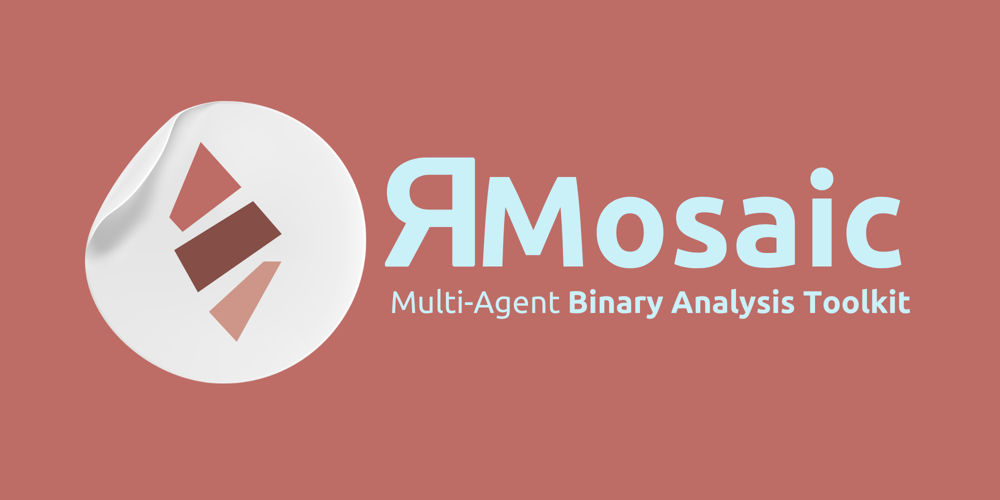

<p align="center">
    
  </a>
</p>
<p align="center"> 🤖 Multi-Agent Binary Analysis Toolkit 🧩 </p>

<div align="center">


<br>

</div>

# 📙 Overview
Reverse Mosaic is driven by a multi-agent large language model, and is prompted using the [ReAct](https://www.promptingguide.ai/techniques/react#results-on-knowledge-intensive-tasks) prompting framework, and as such it is entirely autonomous. RMosaic includes various tools for analyzing binary files, such as extracting text, retrieving file types, finding flaws and vulnerabilities, interacting with Ghidra, and retrieving strings. Reverse Mosaic can generate query tool briefs from PDF files, providing a summary of the content and relevant information for analysis.

# 🎒 Default Tools
The following proof-of-concept tools are included in RMosaic by default.
- ⚒️ **Ghidra Tool**: The [Ghidra Tool](https://github.com/user1342/Reverse-Mosaic/tree/main/ReverseMosaic/tool_hub/tools/ghidra_tool) provides RMosaic with functionality for decompiling a binary, extracting addresses and function names, as well as checking cross-references.
- 😈 **Flawfinder Tool**: The [Flaw-Finder tool](https://github.com/user1342/Reverse-Mosaic/tree/main/ReverseMosaic/tool_hub/tools/flaw_finder_tool) allows RMosaic to identify vulnerabilities in decompiled C code.
- 🧵 **Strings Tool**: The [strings tool](https://github.com/user1342/Reverse-Mosaic/tree/main/ReverseMosaic/tool_hub/tools/strings_tool), allows RMosaic to extract strings found in a binary.

# ⚙️ Installation

## System Requirements
Reverse Mosaic uses the Mistral-7B-Instruct-v0.2 model, and where possible offloads processing to your system's GPU. It is recommended to run Reverse Mosaic on a machine with a minimum of 16GB of RAM and a dedicated Nvidia GPU with at least 4GB of memory. **However,** it can run on lower spec machines, but will be significantly slower.

**Reverse Mosaic has been tested on Windows 11; however, it should be compatible with Unix and other systems.**

## Dependencies
Reverse Mosaic requires **Nvidia CUDA** which allows for greatly increased performance of the LLM. For this follow the below steps:
- Ensure your Nvidia drivers are up to date: https://www.nvidia.com/en-us/geforce/drivers/
- Install the appropriate dependancies from here: https://pytorch.org/get-started/locally/
- Validate CUDA is installed correctly by running the following and being returned a prompt ```python -c "import torch; print(torch.rand(2,3).cuda())"```

Reverse Mosaic requires [Ghidra](https://ghidra-sre.org/) to be installed and accessible. Additionally, ensure that `analyzeHeadless` is available in your environment. 

## Clone this repository:

```bash
git clone https://github.com/your/repo.git
cd Reverse-Mosaic
```

## Create a virtual environment (recommended):

```bash
python3 -m venv venv
source venv/bin/activate
```

## Install the package tool(s) dependencies:
The following installs all nested tool dependancies, copies the tools to the ```<user>\.ReverseMosaic``` folder, and installs the ReverseMosaid package. 
```bash
python install_all_tool_requirements.py <path_to_python_executable>
```
## Generating Tool Briefs
Depending on your task you may want to provide Reverse Mosaic with additional context. This can be done in the form of PDFs. For example are you doing a task on malware analysis, then provide Reverse Mosaic with a PDF on malware analysis. PDF tool briefs only need to be generated once (just don't delete or remove the PDF before your first run). To generate a query tool brief from a PDF file use the following command:

```bash
ReverseMosaic.exe  --pdf_tool_data_path <path_to_pdf_file_or_directory>
```

## Building Complex Tools
For a guide on building more complex tools see the [readme](https://github.com/user1342/Reverse-Mosaic/tree/main/ReverseMosaic/tool_hub) here!

# 🦾 Usage
Reverse Mosaic provides two main functionalities: generating tool briefs from PDF files and executing analysis tasks based on deployment directives.


## Executing Analysis Tasks
To execute analysis tasks based on a deployment directive, use the following command:

```bash
ReverseMosaic.exe  --deployment_directive <directive_description>
```

## Example Usage

```bash
# Generate a tool brief from a PDF file
ReverseMosaic.exe  --pdf_tool_data_path /path/to/pdf/file.pdf

# Generate tool briefs from all PDF files in a directory
ReverseMosaic.exe  --pdf_tool_data_path /path/to/pdf/directory

# Execute analysis task based on deployment directive
ReverseMosaic.exe  --deployment_directive "Analyze binary for vulnerabilities"
```

# 🤖 Mistral-7B-Instruct-v0.2
Behind the scenes Reverse Mosaic uses the ```Mistral-7B-Instruct-v0.2``` model from The Mistral AI Team - see [here](https://arxiv.org/abs/2310.06825). The Mistral-7B-Instruct-v0.2 Large Language Model (LLM) is an instruct fine-tuned version of the Mistral-7B-v0.2. More can be found on the model [here!](https://huggingface.co/mistralai/Mistral-7B-Instruct-v0.2).
- 7.24B params
- Tensor type: BF16
- 32k context window (vs 8k context in v0.1)
- Rope-theta = 1e6
- No Sliding-Window Attention

# 🙏 Contributions
Reverse Mosaic is an open-source project and welcomes contributions from the community. If you would like to contribute to Reverse Mosaic, please follow these guidelines:

- Fork the repository to your own GitHub account.
- Create a new branch with a descriptive name for your contribution.
- Make your changes and test them thoroughly.
- Submit a pull request to the main repository, including a detailed description of your changes and any relevant documentation.
- Wait for feedback from the maintainers and address any comments or suggestions (if any).
- Once your changes have been reviewed and approved, they will be merged into the main repository.

# ⚖️ Code of Conduct
Reverse Mosaic follows the Contributor Covenant Code of Conduct. Please make sure to review and adhere to this code of conduct when contributing to AutoCorpus.

# 🐛 Bug Reports and Feature Requests
If you encounter a bug or have a suggestion for a new feature, please open an issue in the GitHub repository. Please provide as much detail as possible, including steps to reproduce the issue or a clear description of the proposed feature. Your feedback is valuable and will help improve Reverse Mosaic for everyone.

<p align="center">  </p>
